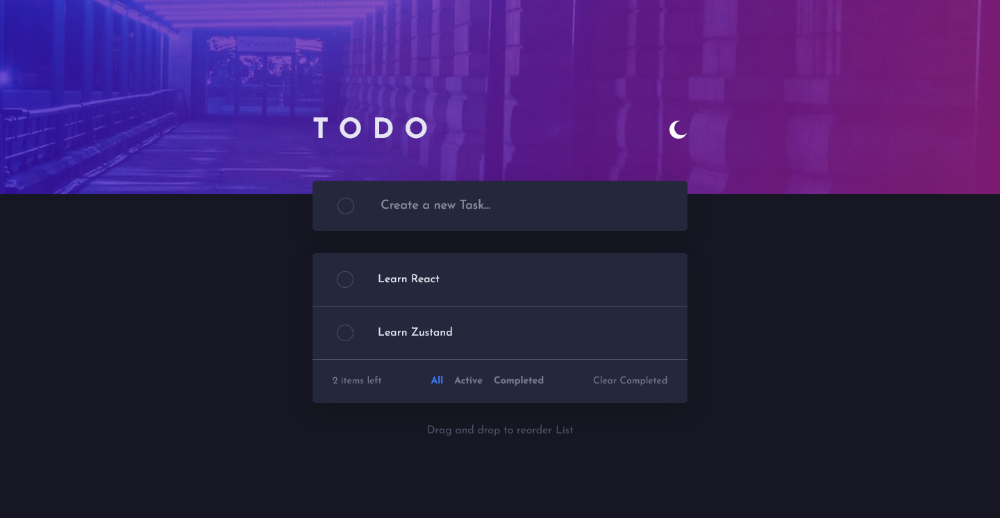
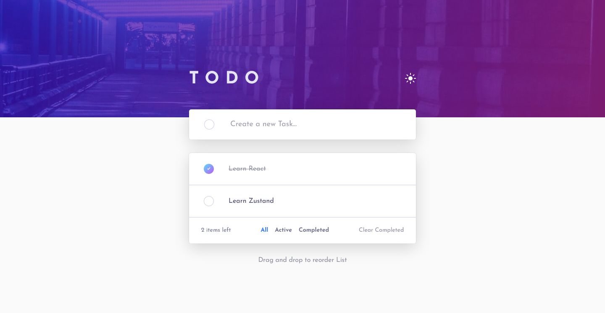
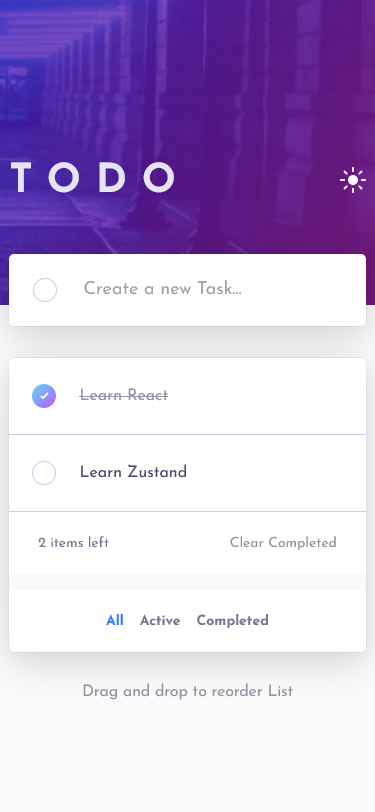
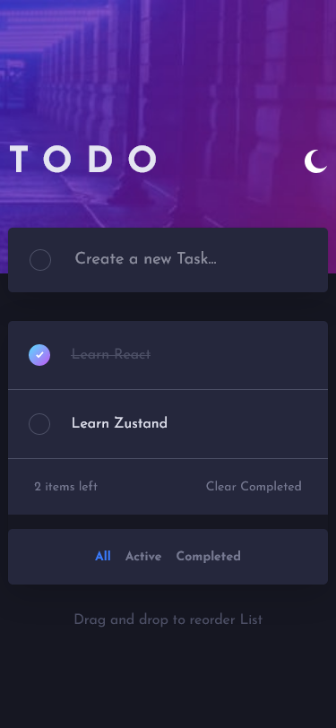

# Frontend Mentor - Todo app solution

This is a solution to the [Todo app challenge on Frontend Mentor](https://www.frontendmentor.io/challenges/todo-app-Su1_KokOW). Frontend Mentor challenges help you improve your coding skills by building realistic projects.

## Table of contents

- [Overview](#overview)
  - [The challenge](#the-challenge)
  - [Screenshot](#screenshot)
  - [Links](#links)
- [My process](#my-process)
  - [Built with](#built-with)
  - [What I learned](#what-i-learned)
  - [Continued development](#continued-development)
  - [Useful resources](#useful-resources)
- [Author](#author)
- [Acknowledgments](#acknowledgments)

**Note: Delete this note and update the table of contents based on what sections you keep.**

## Overview

### The challenge

Users should be able to:

- View the optimal layout for the app depending on their device's screen size
- See hover states for all interactive elements on the page
- Add new todos to the list
- Mark todos as complete
- Delete todos from the list
- Filter by all/active/complete todos
- Clear all completed todos
- Toggle light and dark mode

### Screenshot

### Links

- [Github Repo](https://github.com/Clytax/todoapp)
- Live Site URL: [Vercel](https://todoreact-eta.vercel.app/)

## My process

### Built with

- Mobile-first workflow
- Zustand - Global State
- [React](https://reactjs.org/) - JS library
- Semantic HTML5 markup
- JSX

- SCSS | Mixins | Functions | Media queries | Variables |
- CSS custom properties
- CSS Grid
- Bem Naming Convention
- Flexbox

### What I learned

Wow this definetly was a great journey! I didnt think I would be able to do this challenge with my current skillset but it feld amazing when I realised that I can! I learned how to use the global state library Zustand and also use Media queries inside of react! I tried to add the drag and drop method but I wasnt able to implement.

### Continued development

If I manage to implement drag-and-drop functionality, I'd love to, but for now I'm happy with how this turned out, and I'm about to embark on a new challenge ^^

### Useful resources

- [Zustand blog guide](https://blog.bitsrc.io/zustands-guide-to-simple-state-management-12c654c69990) - Useful guide to understand Zustand better.

## Author

- Frontend Mentor - [@Clytax](https://www.frontendmentor.io/profile/Clytax)
- Twitter - [@EinfachCoden](https://www.twitter.com/einfachcoden)

## Acknowledgments

I want to commend this amazing community! I am so glad I got to know Frontendmentor because it has helped me a lot on my web development journey!
